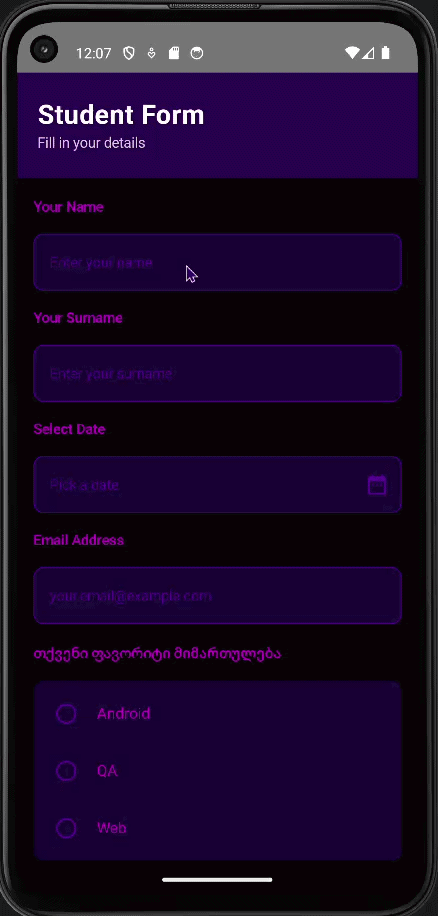

# Student Form — Android App

A single-screen Android application built with Jetpack Compose that collects student information through a form.

---

## Example

### The recording shows:
1. **ავტორიზაცია** — სახელი და გვარი იწერება "Your Name" და "Your Surname" ველში ვიდეოს დასაწყისში
2. **ვალიდაცია** — Submit ღილაკზე დაჭერა ცარიელი ველების დროს → Toast: "შეავსეთ ყველა ველი!"
3. **ინტერაქცია** — კალენდრის გახსნა და თარიღის არჩევა (ნაჩვენებია DD/MM/YYYY ფორმატით)
4. **დასრულება** — ყველა ველის შევსება და წარმატებული Submit → Toast: "მონაცემები გაიგზავნა!"

